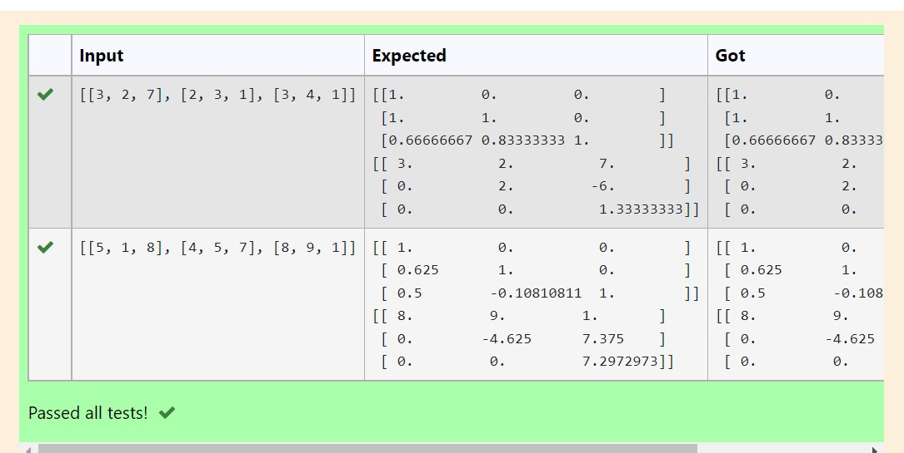
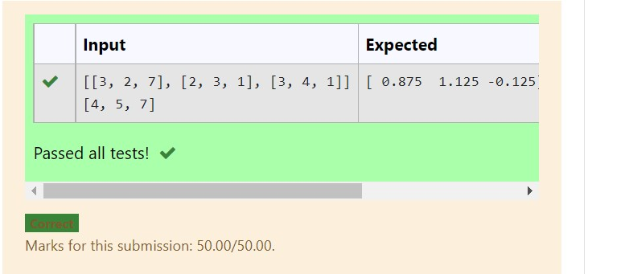

# LU Decomposition without zero on the diagonal

## AIM:
To write a program to find the LU Decomposition of a matrix.

## Equipments Required:
1. Hardware – PCs
2. Anaconda – Python 3.7 Installation / Moodle-Code Runner

## Algorithm
### step 1 :program start with numpy as np
### step 2 :from scipy.linalg import lu
### step 3: from scipy.linalg import lu
### step 4: print the value
### step 5:program runs sucessfully
## Program:
# To print L and U matrix
import numpy as np

from scipy.linalg import lu 

A=np.array(eval(input()))

P,L,U=lu(A)

#P,L,U=scipy.linalg.lu(A)

print(L)

print(U) 

```
/*
Program to find the LU Decomposition of a matrix.
Developed by: M.GUNASEKHAR
RegisterNumber: 21004955
*/
```

## Output:



## Result:
Thus the program to find the LU Decomposition of a matrix is written and verified using python programming.
# LU Decomposition without zero on the diagonal

## AIM:
To write a program to find the LU Decomposition of a matrix.

## Equipments Required:
1. Hardware – PCs
2. Anaconda – Python 3.7 Installation / Moodle-Code Runner

## Algorithm
### step 1 :program start with numpy as np
### step 2 :from scipy.linalg import lu
### step 3: from scipy.linalg import lu
### step 4: print the value 
### step 5:program runs sucessfully
## Program:
```
import numpy as np
import scipy
from scipy.linalg import lu_factor,lu_solve 
A=([[3,2,7,],[2,3,1],[3,4,1]])
B=([4,5,7])
lu,piv=lu_factor(A)
x=lu_solve((lu,piv),B)
print(x)
```
/*
Program to find the LU Decomposition of a matrix.
Developed by: M.GUNASEKHAR
RegisterNumber: 21004955
*/


## Output:



## Result:
Thus the program to find the LU Decomposition of a matrix is written and verified using python programming.


